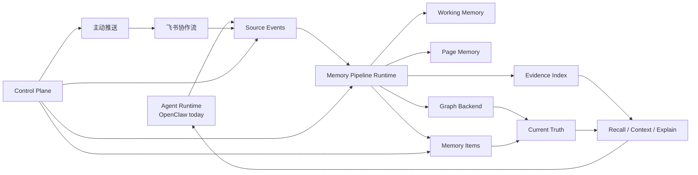

<p align="center">
  
</p>

<h1 align="center">MemWing</h1>

<p align="center">
  <strong>面向 workplace agents 的 long-term collaborative memory。</strong>
</p>

<p align="center">
  MemWing 为办公智能体提供可治理的长期协作记忆：采集 Source Events，
  构建 Current Truth，提供项目上下文、记忆生命周期管理和主动推送。
</p>

<p align="center">
  <a href="https://github.com/GaosCode/MemWing"></a>
  
  
  
  
  <a href="#license"></a>
</p>

<p align="center">
  
  
  
  
  
</p>

<p align="center">
  <a href="../README.md">English</a> |
  <a href="#快速开始">快速开始</a> |
  <a href="#control-plane">Control Plane</a> |
  <a href="#运行配置">运行配置</a> |
  <a href="#架构">架构</a> |
  <a href="#cli">CLI</a> |
  <a href="#license">License</a>
</p>

---

## 为什么需要 MemWing

很多办公智能体很聪明，但很健忘。它能回答当前问题，却很难跨越项目决策、飞书讨论、工具调用、
截止日期变化，以及“这件事我们上周已经决定过了”的协作上下文。

MemWing 是为这类智能体设计的企业级长程协作记忆系统。它保存权威的 Source Events，派生可召回
的记忆层，区分当前事实和历史证据，并提供 Control Plane，让人可以审核、修订、归档、擦除和推
送记忆。

它关注的不只是“存下来”，而是让记忆可解释、可治理、可主动服务团队。

## 快速开始

目标体验像安装一个普通本地工具一样简单：

```bash
brew install memwing
memwing quickstart
```

也可以使用安装脚本：

```bash
curl -fsSL https://raw.githubusercontent.com/GaosCode/MemWing/main/packaging/install.sh | sh
memwing quickstart
```

`memwing quickstart` 默认使用 Lite profile。它会创建本地状态、链接 OpenClaw 插件、配置
ContextEngine，并启动 MemWing Runtime。

```bash
memwing status
memwing doctor
```

## Control Plane

MemWing 不只是记忆 API，也提供给人使用的记忆治理界面。

```bash
memwing control-plane
```

你可以在 Control Plane 中：

- 审核 Memory Items 是否应该成为长期上下文
- 查看回答或推送背后的 Source Events
- 审批、归档、擦除或清理记忆，并记录原因
- 观察 Page Memory、pipeline readiness 和维护队列
- 将重要记忆卡片主动推送回协作流

## 运行配置

| Profile | 适合场景 | 存储 | 派生后端 | 启动方式 |
| --- | --- | --- | --- | --- |
| **Lite** | 个人试用、演示、不想管理数据库的 OpenClaw 用户 | SQLite | graph 和 evidence 关闭 | `memwing quickstart` |
| **Full Local** | 本地完整检索链路评估 | Postgres | Qdrant + Neo4j / Graphiti | `memwing quickstart --profile full-local` |
| **Production** | 使用托管基础设施的团队 | Postgres | 托管 Qdrant + Neo4j / Graphiti | `memwing setup --profile production` |

Lite 尽量接近 C 端软件体验：不要求 Docker、Postgres、Qdrant、Neo4j，也不要求为记忆系统单独配置
模型凭证。默认模型调用会复用 agent runtime。

## OpenClaw 与飞书

MemWing 不绑定任何平台，但当前优先打通了 OpenClaw 路径，并围绕飞书协作场景设计了长期记忆流。

在 OpenClaw 中，MemWing 提供：

- ContextEngine，用于上下文装配、after-turn 捕获和 compact
- conversation hooks，用于采集 Source Events
- 记忆搜索、来源查询、项目上下文和解释工具
- 兼容 agent workflow 的 native memory shim

在飞书式协作流里，MemWing 关注：

- 项目决策及其理由
- 不断变化的偏好和截止时间
- 团队反复执行的工作流
- 应该在被遗忘前主动浮现的信息

## 架构



核心概念：

- **Source Event**：权威的原始协作事件。
- **Current Truth**：召回时优先使用的当前事实集合。
- **Page Memory**：可编辑、可重建的项目或线程中期摘要。
- **Memory Item**：带生命周期状态的长期记忆单元。
- **Evidence Index**：基于 Source Events 派生的检索层。
- **Graph Backend**：实体关系、有效性和历史关系层。
- **Control Plane**：给人使用的记忆治理界面。

## CLI

```bash
# 一条命令完成本地启动
memwing quickstart

# 根据已有配置启动 runtime
memwing start

# 查看配置和健康状态
memwing status
memwing doctor

# 打开记忆治理界面
memwing control-plane

# 安装或检查 OpenClaw 插件
memwing openclaw install
memwing openclaw status

# 生成生产配置骨架
memwing setup --profile production
```

自动化脚本仍然可以使用底层 `memwing control ...` 命令族直接调用 Control API。

## 开发

后端环境：

```bash
uv sync
uv run pytest
uv run ruff check .
```

本地启动后端：

```bash
# 同时启动 API 和 Memory Pipeline Runtime
uv run memwing-runtime

# 或者分别启动入口
uv run memwing-api
uv run memwing-pipeline
```

CLI 开发：

```bash
uv run memwing quickstart --skip-openclaw --no-start
uv run memwing status --no-health
uv run memwing doctor --json
```

Control Plane 前端：

```bash
cd frontend
npm install
npm run dev
```

OpenClaw 插件开发：

```bash
cd memwing/integrations/openclaw
npm install
npm run build
npm run smoke
```

## 项目状态

MemWing 仍在快速演进。当前重点是 v1 memory runtime、OpenClaw 集成、Lite 安装体验、
Control Plane API、benchmark 支持和 local-first 开发工作流。

## License

MemWing 使用 Apache License 2.0 发布。完整许可证文本见根目录 `LICENSE` 文件。
